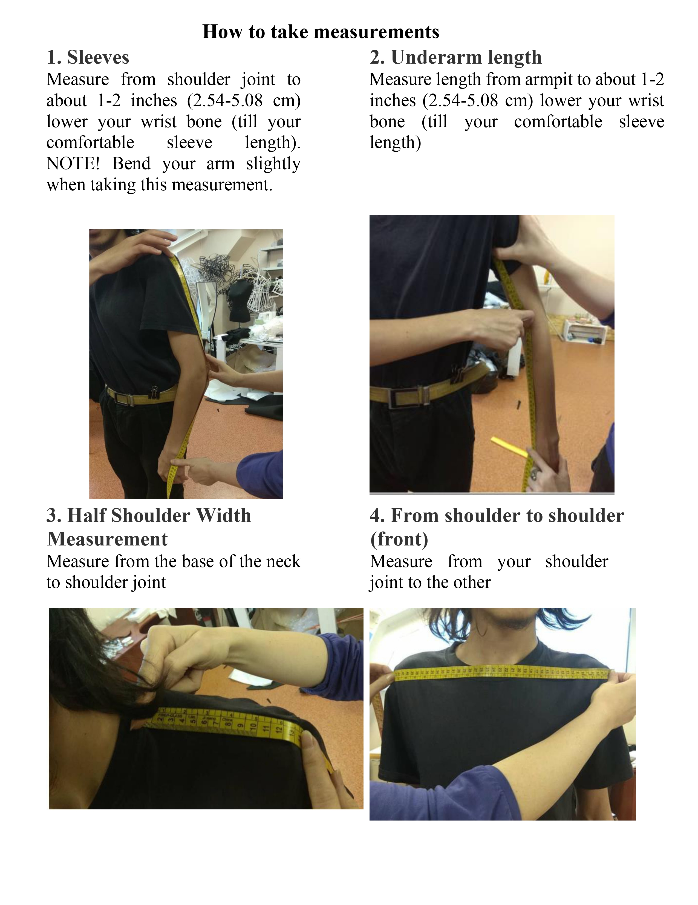
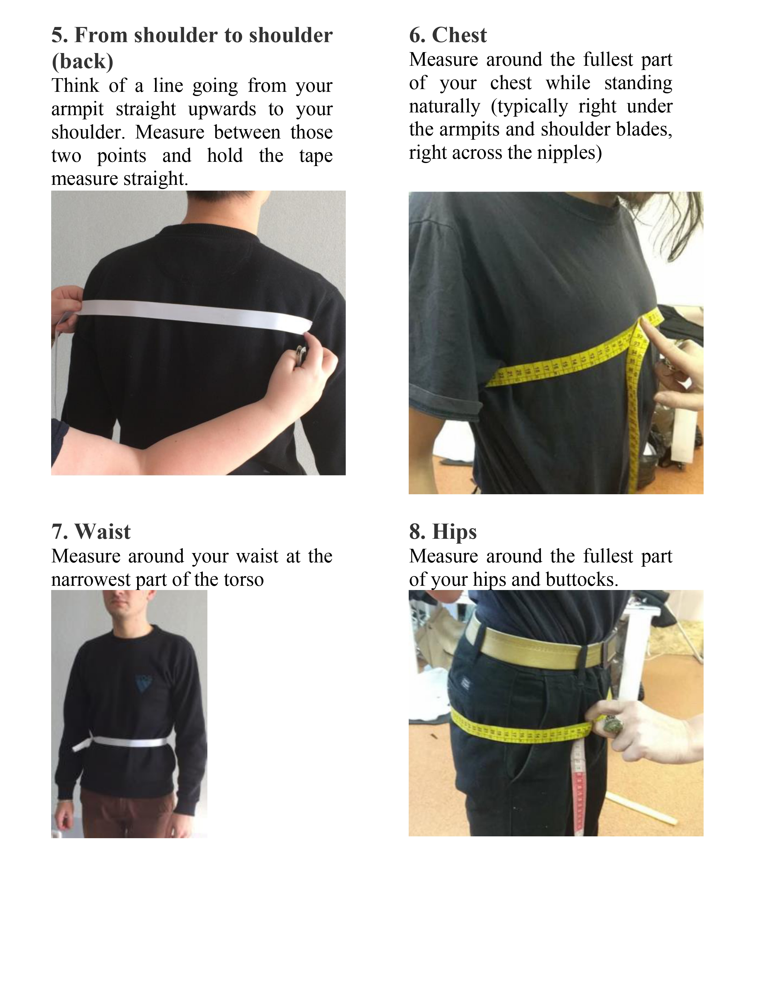
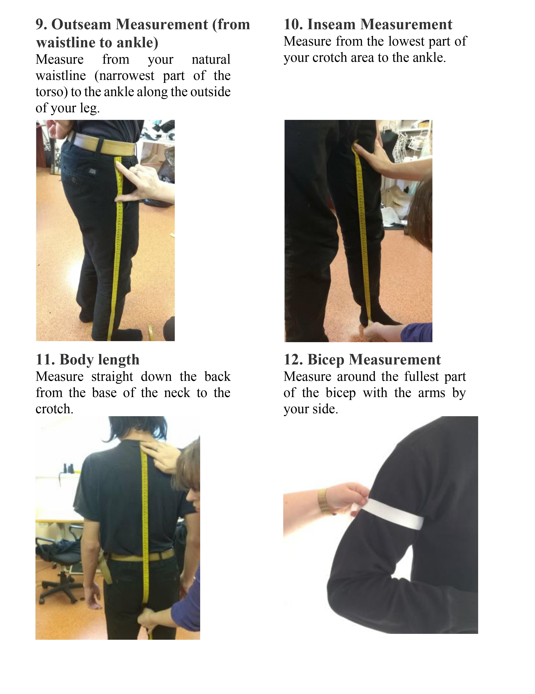
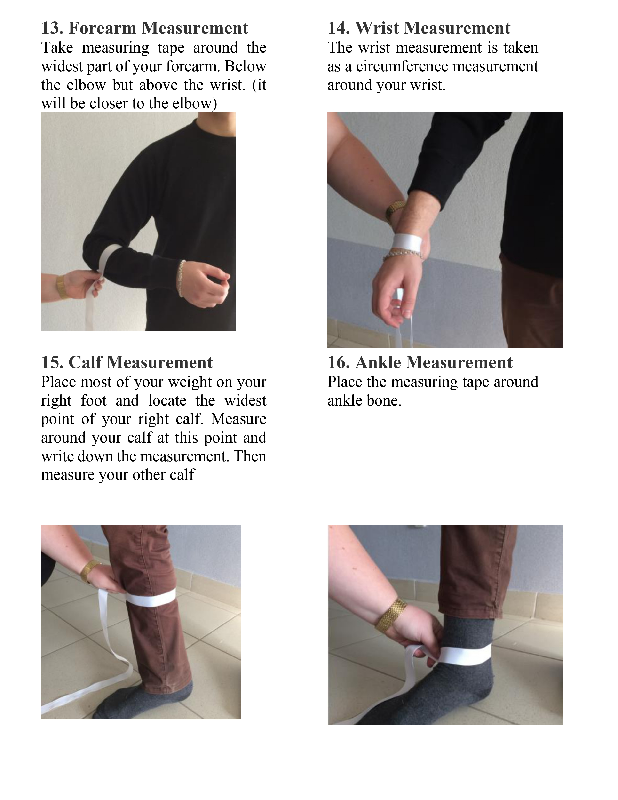
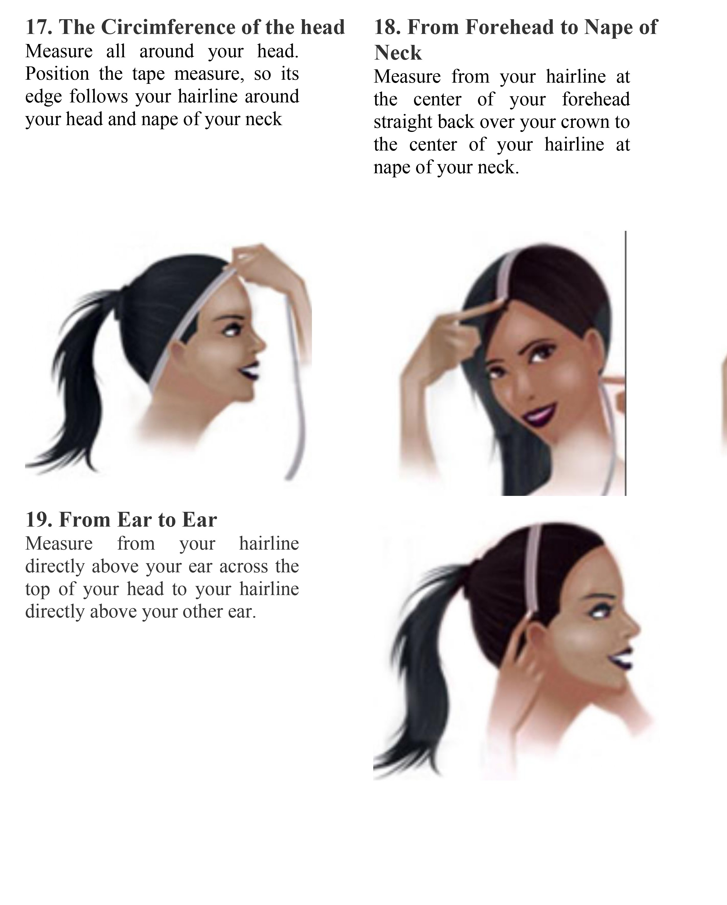
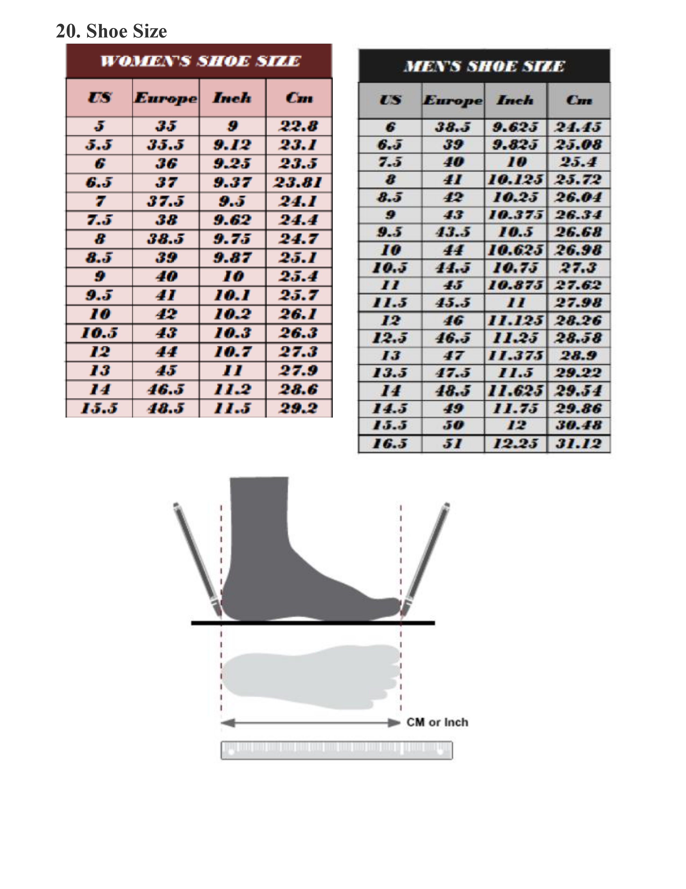
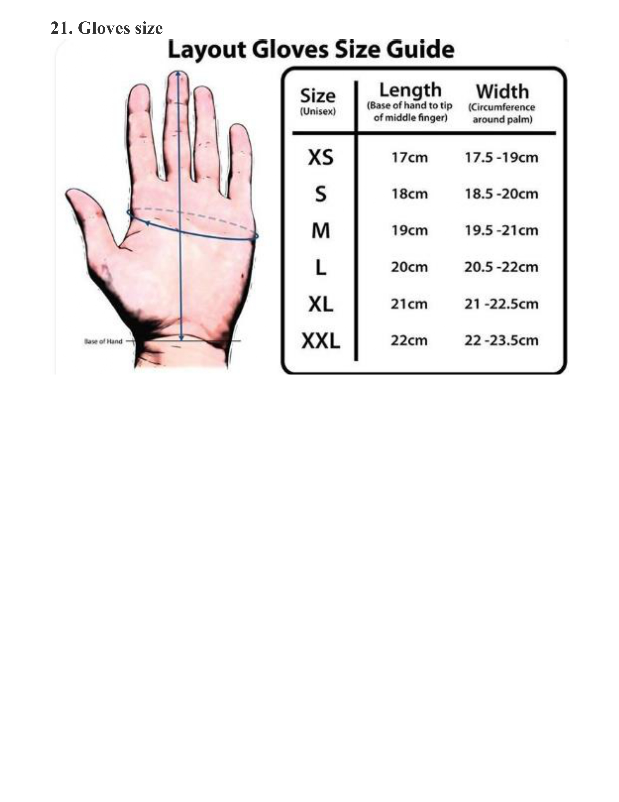

# How to take all measurements

Please answer the following questions:

|    |  Measurement Description                                       | Value         |
|----|---------------------------------------------------------------|---------------|
|    | **Height**                                                    |               |
|    | **Weight**                                                    |               |
| 1  | Sleeves                                                       |               |
| 2  | Underarm length                                               |               |
| 3  | Half Shoulder Width Measurement                               |               |
| 4  | From shoulder to shoulder (front)                             |               |
| 5  | From shoulder to shoulder (back)                              |               |
| 6  | Chest                                                         |               |
| 7  | Waist                                                         |               |
| 8  | Hips                                                          |               |
| 9  | Outseam Measurement                                           |               |
| 10 | Inseam Measurement                                            |               |
| 11 | Body length                                                   |               |
| 12 | Bicep Measurement                                             |               |
| 13 | Forearm Measurement                                           |               |
| 14 | Wrist Measurement                                             |               |
| 15 | Calf Measurement                                              |               |
| 16 | Ankle Measurement                                             |               |
|    | **Optional Measurements**                                     |               |
| 17 | The Circumference of the Head                                 |               |
| 18 | From Forehead to Nape of Neck                                 |               |
| 19 | From Ear to Ear                                               |               |
| 20 | Shoe Size *(choose from chart at the end of the file)*        |               |
| 21 | Gloves Size *(choose from chart at the end of the file)*      |               |

Instructions on how to take measurements:

<strong>Body Measurements</strong>

<strong>Optional measurements, for costumes that have masks, shows and/or gloves</strong>

